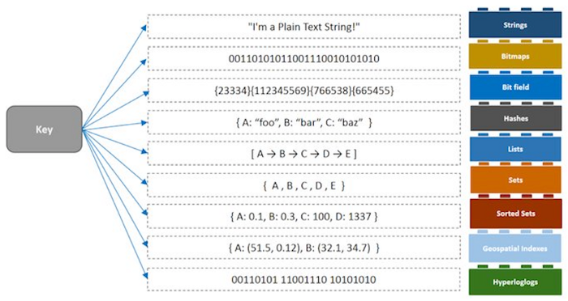
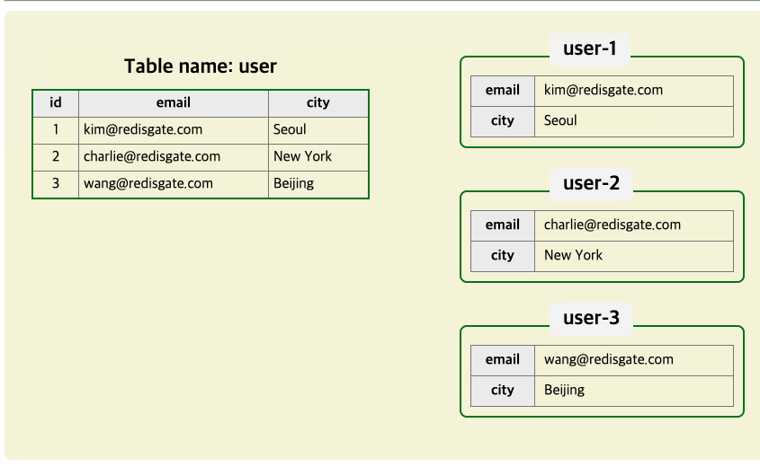
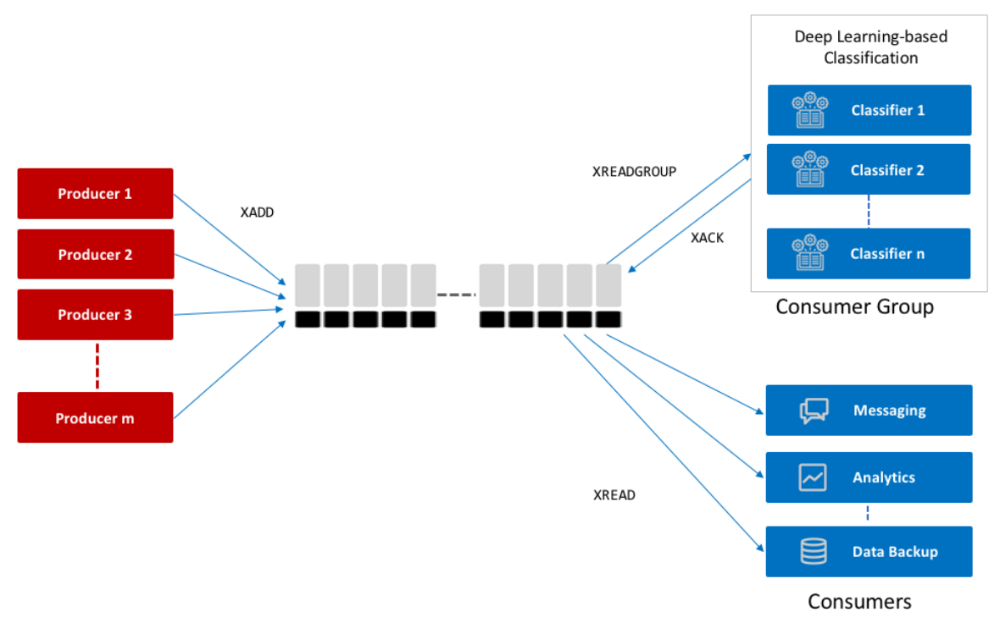
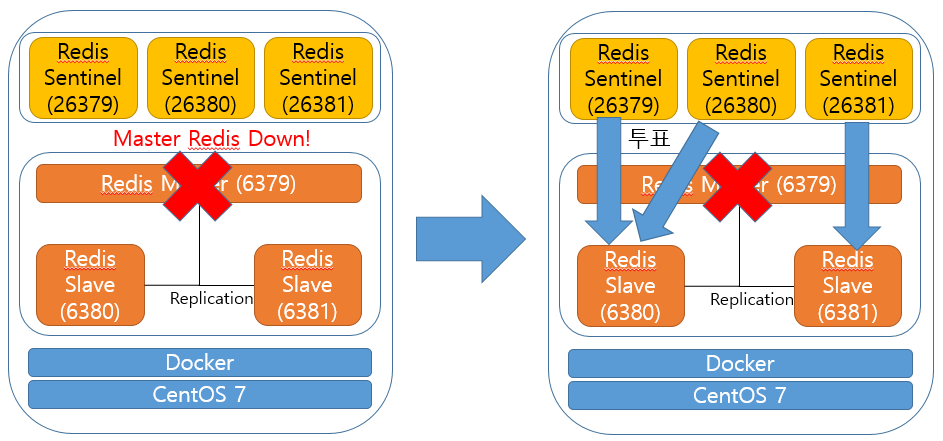
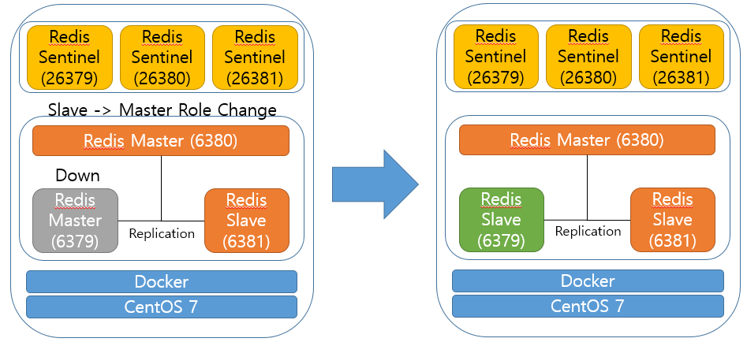

# Redis

## 목차
---
[Redis란?](#Redis란)

[자료형](#자료형)

[Key Design](#KeyDesign)

[성능](#성능)

[메모리관리](#메모리관리)

[Fail-Over](#FailOver)

[Cluster-Sentinel](#Cluster-Sentinel)

[Fork](#fork)

[참고자료](#Reference)

## Redis란
---

In-Memory Data Structure Store Based on Key-Value pair

## 자료형
---

### String
* Key와 Value가 1:1 의 모든 Binary-safe strings을 key와 value에 담을 수 있습니다.
* 문자열 길이 값은 최대 512MB
* 성능 : O(1)
> #### Binary-Safe Strings?
> 이진 안전 문자열이란 byte를 포함한 모든 character로서 한글, 알파벳, 숫자 등 모든 byte base character를 
> 담을 수 있으며 여기에는 jpeg같은 이미지 데이터도 가능합니다.

### Lists
* Key와 value가 1:N 관계의 자료형으로 value는 입력한 순서대로 저장됩니다.
* 주로 Queue와 Stack을 사용할때 이용합니다.
* value가 저장되면 key는 자동 생성됩니다. 반대로 key에 value가 없으면 키는 삭제됩니다.
* value에 대한 값은 중복 저장이 가능합니다.
* 데이터 압축이 가능하여 메모리 절약이 가능합니다.
* 성능 : O(1)

### Sets
* Key와 value가 1:N 관계의 자료형입니다.
* Lists와 다르게 입력된 순서와 상관없이 저장됩니다.
* 데이터 중복 저장이 되지 않습니다. ex)value A를 두번 저장해도 1개의 value만 남습니다.
* 집합이라는 의미에서 value를 member라 칭하기도 합니다.
* 데이터 압축 X
* 집합 연산이 필요할 경우 사용합니다. ex)특정 데이터를 한번 이상 본 경우를 체크할때, 좋아요, 싫어요 등의 사용자 집합군의 데이터를 저장할때* 성능 : O(1)

### Sorted sets
* 1개의 key에 여러개의 score, value로 구성되는 자료형
* 모든 value는 score로 정렬되어 저장되며 score가 같으면 value로 정렬됩니다.
* 집합이라는 의미에서 value를 member라 칭하기도 합니다.
* 랭킹과 같이 정렬이 필요한 데이터를 저장할때 사용됩니다.
* sorted sets의 자료구조 내부적으로 `zip list`와 `skip list`으로 구성되어 저장됩니다.

### Hash
* Key와 value 가 1:N(field, value) 관계의 자료형입니다.
* key하나에 field, value쌍을 40억개(4,294,967,295)개 저장 가능합니다.
* Hash는 RDB의 Table과 유사하게 사용할 수 있습니다.
* any의 경우 정책, 인증, installer 정보등을 Hash 자료형으로 활용 가능

### HyperLogLogs
* 중복제거된 값을 매우 적은비용과 매우 빠른 속도로 계산하는데 사용하는 확률적 자료구조 입니다
* 대용량의 데이터에서 `unique value`를 계산하는데 사용되는 자료구조 입니다.
* 주료 사용처는 대규모 포털사이트의 방문자수, 검색엔진의 검색량 계산등 대용량 데이터에 대한 `unique value`와 관련된 연산을 할때 주료 사용합니다.

### Streams
* 로그 데이터를 처리하기 위해 5.0버전에 새로 도입된 자료형
* 다른 자료형과 다르게 consumer를 지정해서 데이터를 읽을 수 있고 consumer가 데이터를 처리했는지
확인할 수 있는 방법을 제공합니다.
* 즉 rabbitMQ나 kafka와 같이 비동기 큐 처리를 위한 기능을 제공합니다.

## KeyDesign
---

* Key는 줄임말보다는 일반적인 단어를 사용하는것을 권장합니다.
* key를 구성할땐 구분자를 사용하는것을 권장합니다. ex) :, -, _, /
 

## 성능
---
* redis의 성능에 가장 큰 영향을 끼치는 요소 10가지

1. Network bandwidth & latency
2. CPU
3. RAM speed & memory bandwidth
4. Virtualization
5. TCP/IP loop back & unix domain socket
6. Pipelining
7. NUMA
8. Client Connection
9. NIC
10. Memory allocator

* 위의 요소 중 가장 영향을 많이 받는것은 CPU, Network입니다.
* redis는 Network에 영향을 많이 받습니다. (쿼리량이 많기 때문에) 
  때문에 redis 문서에선 네트워크 환경으로 10 Gbit/s NIC 또는 TCP/IP bonding한 1 Gbit/s NICs를 권장합니다.
* redis는 single Thread이기 때문에 때문에 CPU의 코어가 많은 것보다는 CPU의 대용량 캐시가 성능에 더 
  영향을 끼칩니다.

## 메모리관리
---
* redis는 physical 메모리가 부족할 경우 swap 메모리를 사용하지만 swap 메모리 사용시 속도 저하가 발생합니다.
* swap은 한번 발생하면 계속 발생합니다.
* swap이 없다면 OOM으로 서비스가 죽을 수 있습니다.
* Maxmemory설정을 한다고 해도 이보다 더 사용할 가능성이 있습니다.
* 큰 메모리를 사용하는 instance 하나보다는 적은 메모리를 사용하는 instance 여러개가 안전합니다.

## FailOver
---
* Redis는 master-slave 관계의 failover 기능을 제공합니다. 
* 이 기능은 redis의 replication기능을 이용합니다. 마스터 노드의 데이터를 거의 실시간으로 슬레이브에 복사 하는 작업으로 진행됩니다.
* 따라서 마스터 노드에 장애가 발생하더라도 데이터 손실을 최소화 하며 슬레이브 노드가 작업을 이어받아 서비스를 유지 할 수 있습니다.
* master-slave는 물리적으로 다른 머신에 두는 것을 권장합니다.
* 슬레이브는 n대를 둘 수 있으며 이 슬레이브는 또다른 슬레이브를 둘 수 있습니다.(3차 백업 개념)
* 전체 동기화 vs 부분 동기화
> 전체 동기화
>
> 장애 발생시 자식 프로세스가 즉각 .rdb 파일을 생성하여 슬레이브 서버로 전송 후 복제서버가 서비스를 이어 받는 방 

> 부분 동기화
>
> 마스터-슬레이브는 run id 와 replication offset 있으므로 장애 발생시 압축하여 슬레이브에 전송합니다.
> 이를 받은 슬레이브는 자신이 갖고 있는 run id 와 비교하여 그 이후에 생성된 데이터만 저장하여 서비스를 지속합니다. 

* 슬레이브 서버는 기본적으로 읽기 전용이며 슬레이브에 데이터를 입력해도 마스터의 데이터로 덮어써집니다.

## Cluster-Sentinel
---
* 센티넬은 failover 시스템의 강화판으로 슬레이브가 2대 이상일 경우 사용되는 slave 선정용 서비스입니다.
* 마스터가 장애가 발생 할 경우 센티넬들은 즉각 투표를 시작하며 현재 준비된 슬레이브들증 마스터를 이어받을 노드를 선정하여 서비스를 이어가도록 합니다.
* 이때 센티넬은 투표 무효될걸 대비해 반드시 홀수로 설정해서 올려야합니다.

* 또한 투표가 완료된 후 다운됬던 마스터가 다시 올라올 경우 해당 노드의 redis.conf 파일을 조작하여 slave로 
변경하여 현재 서비스중인 마스터의 노드를 인식 하도록 자동으로 변경해줍니다.

## Fork & Sharding
---

* To Be Continued?

## 주의사항
---
* redis는 single Thread이기 때문에 하나의 작업이 오래 걸리경우 장애로 이어질 확률이 증가합니다.
* O(N) 관련 명령어 사용은 주의
> KEYS
> FLUSHALL, FLUSHDB
> Delete Collections
> Get All Collections
* item이 몇만개가 있는 `hash, sorted set, set` 데이터를 조회 하는 경우 (위 자료형들은 메모리를 많이 사용합니다.)
* 너무 큰 Collection 을 가져오는건 부담 되기 때문에 collection은 작게 분할하는것을 추천합니다.

## Reference
---

[Redis 공식문서](https://redis.io/documentation )

[Redis 기본 개념](https://sjh836.tistory.com/178)

[Redis 자료형](https://redis.io/topics/data-types-intro)

[Redis 자료형2](https://redis.io/topics/data-types)

[Redis 메모리 최적화](https://redis.io/topics/memory-optimization)

[Redis LRU 알고리즘](https://redis.io/topics/lru-cache)

[Redis Replication](http://redisgate.kr/redis/configuration/replication.php)

[Redis Master-Slave-Sentinel](https://hub.docker.com/r/bitnami/redis-sentinel)

[Redis Sentinel](https://jaehun2841.github.io/2018/12/02/2018-12-02-docker-7/#redis-sentinel%EC%9D%B4%EB%9E%80)

[Redis Architecture](https://jaehun2841.github.io/archives/archives/9/)

[개발자를 위한 레디스 튜토리얼](https://medium.com/garimoo/%EA%B0%9C%EB%B0%9C%EC%9E%90%EB%A5%BC-%EC%9C%84%ED%95%9C-%EB%A0%88%EB%94%94%EC%8A%A4-%ED%8A%9C%ED%86%A0%EB%A6%AC%EC%96%BC-01-92aaa24ca8cc)

[우아한 Redis 세미나](https://ict-nroo.tistory.com/133)

[Cache-Aside Pattern](https://brunch.co.kr/@springboot/151)

[Redis - Cluster & Sentinel 차이점 및 Redis에 대해](https://coding-start.tistory.com/128)

[Key Convention](https://stackoverflow.com/questions/6965451/redis-key-naming-conventions)

[zip list](http://redisgate.kr/redis/configuration/internal_ziplist.php)

[skip list](http://redisgate.kr/redis/configuration/internal_skiplist.php)

[redis 성능 요소](https://timewizhan.tistory.com/entry/Redis-%EC%84%B1%EB%8A%A5%EC%97%90-%EC%98%81%ED%96%A5%EC%9D%84-%EB%81%BC%EC%B9%98%EB%8A%94-%EA%B2%83)

[redis 성능 개선기](https://wariua.github.io/performance/an-optimization-case-redis.html)

[redis 100만, 1000만 성능테스트](https://www.joinc.co.kr/w/man/12/REDIS/PerfTest)
